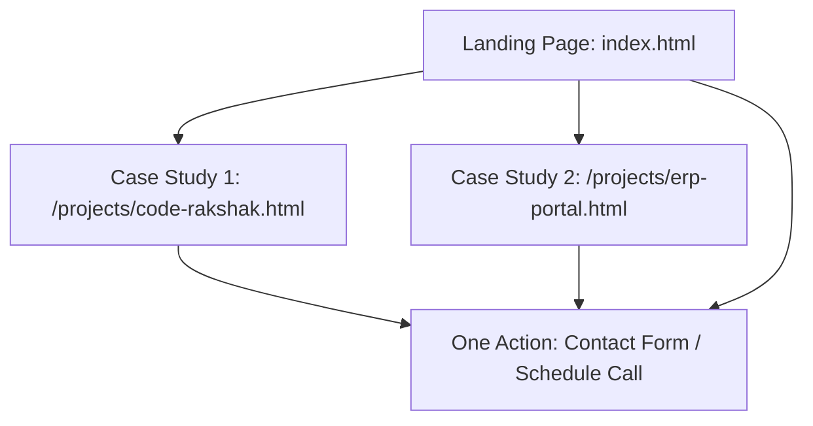

# Portfolio Sitemap Design

This sitemap is designed for a single target audience member, with a single goal in mind: proving a specific technical capability and prompting them to take a single action.

---

## 🎯 Target Audience (The "One Person")
* **Who they are**: A Technical Lead or Engineering Manager at an early-to-mid-stage startup. 
* **Their pain point**: They need developers who can build fast, clean, and performant web apps without adding unnecessary dependencies, bloated frameworks, or complex configurations. They hate marketing fluff and corporate jargon.
* **What they look for**: They look at case studies to see actual architecture decisions, code structure, metrics, and problem-solving skills rather than a laundry list of skills.

---

## 📣 Core Claim (The Proof Statement)
> "I build clean, high-performance web applications and AI-driven tools that solve real workflow bottlenecks—no fluff, no bloat."

---

## ⚡ The One Action (Conversion)
* **What it is**: Filling out a simple form to schedule a short 15-minute technical intro call (via Cal.com/Calendly link or direct email).

---

## 🗺️ Sitemap Structure & Page Blueprint

Each page in this sitemap must earn its place by directly supporting the core claim and leading the visitor to the one action.

### 1. `index.html` (Homepage - Land & Believe)
* **Goal**: Establish the core claim immediately and guide the user to either the proof (projects) or the action (contact).
* **Sections**:
  * **Hero**: A bold, minimal header stating the claim. Two high-contrast CTA buttons: "View the Proof" (anchors to Case Studies) and "Discuss a Project" (anchors to Contact).
  * **Case Studies Grid**: Short visual summaries of the two main projects, highlighting the core metric and outcome for each. Links to deep-dive case studies.
  * **About / Philosophy**: Explains Arun's developer mindset: a CS student at DSCE who builds pragmatically, uses vanilla technologies by default, and leverages AI for efficiency without introducing bloated dependencies.
  * **Contact Section**: A very simple contact form (Name, Email, Message) alongside a scheduling link.

### 2. `/projects/code-rakshak.html` (Case Study 1 - Believe)
* **Goal**: Prove that I can write clean, high-performance AI integrations and developer tools.
* **Key Proof Points**:
  * Resolves code security and formatting scans in under 5 seconds.
  * Details how the parser extracts files, rates security, and generates downloadable PDF summaries on a Node.js server.
  * Shows the exact structural code and explains architecture decisions (vanilla JS and modular node dependencies).
  * **Call to Action**: "Have a custom developer tool or dashboard in mind? Let's talk" (links back to homepage contact).

### 3. `/projects/erp-portal.html` (Case Study 2 - Believe)
* **Goal**: Prove that I can design and build secure, full-stack database-backed applications that solve operational bottlenecks.
* **Key Proof Points**:
  * Replaced manual spreadsheet chaos for project group registrations at DSCE, reducing approval time from weeks to hours.
  * Explains using FastAPI backend, React frontend, and enforcing team size and guide allocation quotas at the Firebase database level.
  * Highlights API route design and input validation schemas (Pydantic).
  * **Call to Action**: "Need help migrating an offline workflow into a secure portal? Let's connect" (links back to homepage contact).
